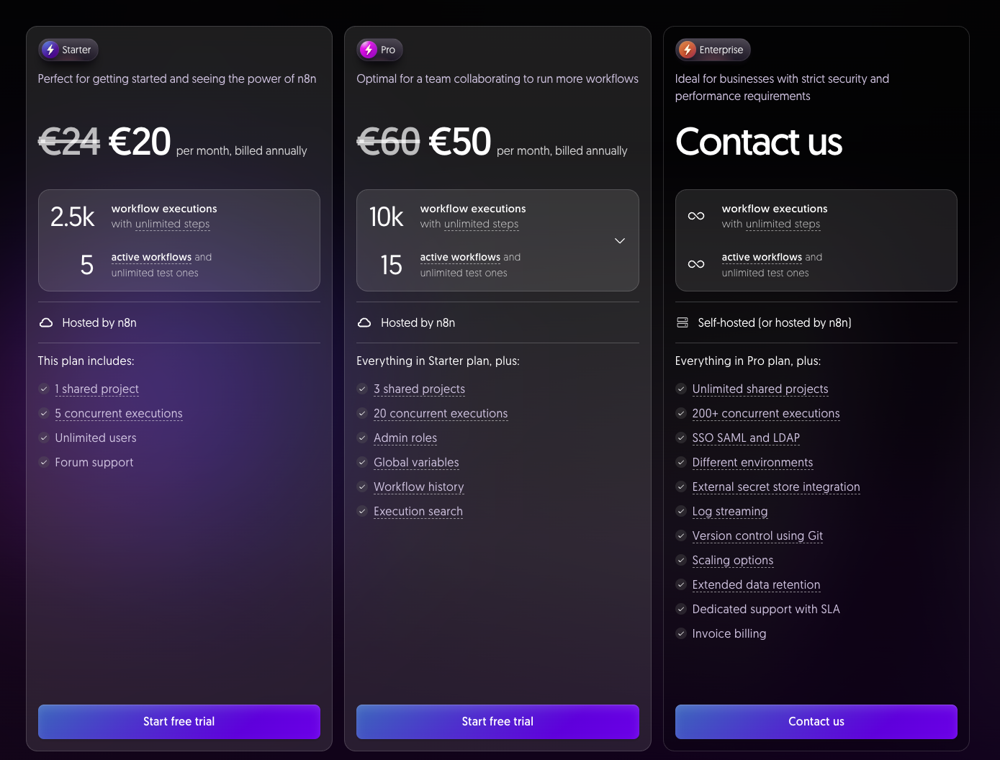

# 5 分鍾在 zeabur 一鍵部署 n8n｜最全手把手安裝教學｜🧠 省力知識庫

# 為何選擇在 zeabur 上使用 n8n！

簡單暴力！因為比在 n8n cloud 便宜

* <https://n8n.io/pricing/>

* <https://zeabur.com/zh-TW/pricing>

## n8n cloud - 每月一頓吃到飽

Starter 方案

* 限制 5 個開啟的工作流

* 最多2500次的工作流執行

## zeabur 收費 - 每月一杯星巴克

最自由，但要花一點時間維護

# 如何一鍵部署 n8n 平台直接使用！
* github - <https://github.com/qwedsazxc78/ai-automation-n8n/blob/main/README.md>

* template (隨時更新) - <https://zeabur.com/zh-TW/templates/0TUVZ7>

## 如果沒有Zeabur帳號需要先註冊

使用我的推薦碼，你跟我都能多拿 5US 使用額度！

* 建議可以綁定 github 帳號，方便快速

* 沒有 github 則使用 email 註冊

## 再點選一鍵部署 n8n 範本

n8n (AI Brain) - 範本

* 你的專案名稱必須要唯一，建議用 n8n-{你的英文名稱}，好記憶 (n8n-alex)

* 需要先等資料庫完成，n8n 才能正確使用

* 第一次資料庫部署太久，n8n 可能會超過重試開啟的次數

* 重開 n8n 連結資料庫，看到 log 有 db migration 就是成功

* 整個過程大概花3分鍾

# 註冊 n8n 管理員，拿到 License key 並啟用
* **註冊畫面**：輸入你的 email ，記得後續要填收到的 license key

* **設定 License key**：進入 n8n 畫面後，點選設定確認版本，點選 Enter activation key 輸入你拿到的License key ，啟用部分的功能。

* **再次要求 License key** ：如果沒有收到，點擊上方的 Get paid features for free (forever)，再收一次信看看，記得檢查垃圾郵件。

# FAQ 常見問題
1. 如何修改專案名稱

   - 點選專案 → 設定

   - 修改專案名稱 → 點選儲存

2. 如何修改 n8n image 版本

   - 點選 n8n 服務 → 設定 → 容器映像檔

   - 修改 tag 版本  → 點選儲存

3. 如何備份專案，避免改錯後可以復原

   - 點選 postgresql 服務 → 備份

   - 點選自動備份 → 點選儲存

